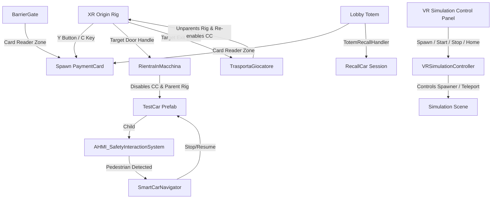

# Valet Guidance, Safety & Payment Card Simulation Guide

This document provides a comprehensive guide to understanding, setting up, and playtesting the fully integrated Valet Guidance, Safety, and Payment Card Simulation in the VR prototype.

---

## 1. System Architecture Overview

The scene is divided into several modular subsystems that communicate dynamically at runtime. This design allows vehicles, UI overlays, and hand-anchored card visual assets to be spawned on command without breaking scene-level references.

### Key Components & Files

*   **VR UI Canvas Prefab**: [VRControlPanelCanvas.prefab](file:///d:/Polimi/4th%20Sem/AHMI/Project/Unity/Prototype/Assets/PreFabs/VRControlPanelCanvas.prefab)
    A world-space VR menu designed with futuristic slate-blue backgrounds, cyan accents, and sliced capsule buttons. Spawns directly in front of the player's view.
*   **Runtime UI Controller**: [VRSimulationController.cs](file:///d:/Polimi/4th%20Sem/AHMI/Project/Unity/Prototype/Assets/Scripts/CarTraffic/VRSimulationController.cs)
    Handles toggling the UI canvas, binding VR buttons, spawning/despawning the hand-anchored Payment Card, clearing active cars/NPCs, and teleporting the player home.
*   **Player Progression Controller**: [PlayerCarProgression.cs](file:///d:/Polimi/4th%20Sem/AHMI/Project/Unity/Prototype/Assets/Scripts/CarTraffic/PlayerCarProgression.cs)
    Manages spawning the player's custom `TestCar` at the entrance, tracking the player's boarding status (`IsPlayerInsideCar`), auto-parking on exit at drop-off (5s delay), and auto-exiting on boarding at pickup (5s delay).
*   **Physical Door Interaction Buttons**: [TeleportButton.cs](file:///d:/Polimi/4th%20Sem/AHMI/Project/Unity/Prototype/Assets/AHMI_MyPlayer/TeleportButton.cs)
    Attached to the physical door handles (`ReturnButton` on driver door, `ReturnButton_Passenger` on passenger door) and internal cockpit button (`ChangeButton`). Disables the player's `CharacterController` during teleportation to prevent physics jitter, and updates boarding status.
*   **Central Valet Brain**: [ValetGuidanceSystem.cs](file:///d:/Polimi/4th%20Sem/AHMI/Project/Unity/Prototype/Assets/Scripts/CarTraffic/ValetGuidanceSystem.cs)
    Manages active car registration, random vacant parking spot allocation, ETA calculations, and vehicle state transitions.
*   **Card & Reader Assets**: [PaymentCard.cs](file:///d:/Polimi/4th%20Sem/AHMI/Project/Unity/Prototype/Assets/Scripts/CarTraffic/PaymentCard.cs), [CardReader.cs](file:///d:/Polimi/4th%20Sem/AHMI/Project/Unity/Prototype/Assets/Scripts/CarTraffic/CardReader.cs), [TotemRecallHandler.cs](file:///d:/Polimi/4th%20Sem/AHMI/Project/Unity/Prototype/Assets/Scripts/CarTraffic/TotemRecallHandler.cs)
    Creates a physical card visual attached to the Left Controller, generates procedural sinus-wave beep sounds on reader trigger overlaps, and wires card validation to active valet sessions.

---

## 2. Controls & Interaction Schemes

The simulation features a **100% VR-native interaction scheme** that does not require keyboard inputs or legacy developer overlays during headset gameplay.

### VR Controls (Quest Controller)

*   **Toggle Control Panel**: Press the **`X`** button on your **Left Quest Controller** to open/close the Simulation Control Panel. (In Editor: press the **`U`** key).
*   **Spawn / Despawn Payment Card**: Press the **`Y`** button on your **Left Quest Controller** to toggle the slate-blue 3D Payment Card anchored to your left hand. (In Editor: press the **`C`** key).
*   **Raycast Pointer Selection**: Use either Quest controller's pointer ray to target buttons on the Control Panel and click the **Index Trigger** to select.
*   **Enter Vehicle (Outside)**: Aim your controller ray at the physical door buttons (**`ReturnButton`** / **`ReturnButton_Passenger`**) and click the **Index Trigger** to enter.
*   **Exit Vehicle (Inside)**: Look inside the car cockpit, target the physical **`ChangeButton`**, and click the **Index Trigger** to exit.
*   **Tapping Reader Zones**: Bring your left hand (with the payment card spawned) close to the entrance ticket machine or lobby Totem's card readers to trigger them.

### Keyboard Fallbacks (Editor Debugging)

For rapid testing in the Unity Editor without a VR headset, the following keyboard hotkeys are available:

| Key | Action | Description |
| :--- | :--- | :--- |
| **`P`** | **Spawn Test Car** | Spawns [TestCar](file:///d:/Polimi/4th%20Sem/AHMI/Project/Unity/Prototype/Assets/PreFabs/TestCar.prefab) at the entrance and pauses NPC traffic. |
| **`G`** | **Toggle Boarding** | Teleports player inside (driver seat) or outside (sidewalk) the car. |
| **`Enter`** | **Progress Valet State** | Drives the car forward to the next stop manually. |
| **`U`** | **Toggle UI Panel** | Toggles the VR Simulation Control Panel Canvas on-screen. |
| **`C`** | **Toggle Payment Card** | Spawns or despawns the 3D payment card attached to the Left Controller pivot. |

---

## 3. Step-by-Step Playtest Walkthrough

Follow this walkthrough to verify the entire system flow:

### Phase 1: Spawning & Physical Gate Entry
1. Put on your VR headset and start the simulation scene.
2. The welcome screen is displayed. Click **ENTER SIMULATION** to dismiss it.
3. Press **`X`** on your left controller to open the Control Panel, then click **SPAWN CAR**. The custom `TestCar` appears at the entrance gate.
4. Close the Control Panel, walk up to either the driver or passenger door, aim your pointer ray at the glowing physical door button, and click to teleport inside.
5. Notice that the gate **remains closed** (for NPCs, it opens automatically after 1.5 seconds, but for the player, it waits).
6. Press the **`Y`** button on your left controller to spawn your payment card.
7. Physically bring your left hand close to the ticket machine reader (`EntranceCardReader`). It will play a crisp beep sound, the gate bar will rotate open, the headlights will turn turquoise (autonomous mode active), and the car will automatically drive to the **Drop-Off Point**.

### Phase 2: Leaving the Car & Auto-Parking
1. The car stops at the Drop-Off area sidewalk. The cockpit dashboard displays the valet greeting overlay.
2. Look at the dashboard, aim your pointer ray at the physical **`ChangeButton`**, and click it to exit onto the sidewalk.
3. Once you get off, the car detects your exit. It starts a **5-second countdown**.
   * *Optional Test*: If you get back in the car before the 5 seconds are up, the auto-park sequence is canceled.
4. After 5 seconds, the car automatically drives to a randomly selected vacant parking spot in the garage and reverse parks itself.
5. The NPC Spawner automatically resumes to populate the environment.

### Phase 3: Lobby Recall via Totem Card Tap
1. Walk to the **Recall Totem** located in the elevator lobby.
2. Press the **`Y`** button to ensure your payment card is spawned on your left hand.
3. Bring your left hand close to the **Totem's card reader** trigger zone.
4. It will play a beep, validate your card (`PLAYER-CARD-9999`), and recall your parked car. The lobby ETA billboard updates with your car's plate number (`PLAYER-1`) and countdown.
5. The car starts up, reverses out of its parking spot, and drives to the **Pick-Up Point**.

### Phase 4: Auto-Exit & final Node Despawning
1. Once the car arrives at the Pick-Up Point sidewalk, click the door button to get back inside.
2. The car detects your boarding and waits for **5 seconds**.
   * *Optional Test*: If you exit the vehicle before 5 seconds pass, the auto-exit drive is canceled.
3. After 5 seconds, the car automatically starts and drives through the exit gate.
4. The car drives all the way to the **final exit node** where NPC cars normally disappear.
5. The car stops at this final node and turns off its headlights, waiting for you to get out.
6. Target the cockpit **`ChangeButton`** and click to exit.
7. As soon as you exit the vehicle, the car visual and database session are clean-despawned.

---

## 4. Editor Automation Tools

Several editor menu utilities are available in the top menu bar under **`Tools`** to configure or regenerate simulation assets:

*   **`Tools/Create VR Canvas Prefab`**
    Programmatically draws custom dashboard textures (`DashboardBG.png`, `ButtonBG.png`), configures 9-sliced sprite borders on the capsule buttons, and saves a fresh [VRControlPanelCanvas.prefab](file:///d:/Polimi/4th%20Sem/AHMI/Project/Unity/Prototype/Assets/PreFabs/VRControlPanelCanvas.prefab) with premium typography.
*   **`Tools/Setup Card Readers`**
    Scans the scene for entrance ticket machines and lobby totems, instantiates `CardReader` trigger objects, positions them, and registers event triggers for gate authorization and recall.
*   **`Tools/Setup VR Scene UI`**
    Clears the old simulation manager in the active scene, spawns a new `SimulationControlManager`, attaches [VRSimulationController](file:///d:/Polimi/4th%20Sem/AHMI/Project/Unity/Prototype/Assets/Scripts/CarTraffic/VRSimulationController.cs), links the prefab asset, and auto-resolves all system references.
*   **`Tools/Setup TestCar Interactables`**
    Loads the player's car prefab, duplicates the driver door button, and places it at the mathematically perfect mirrored coordinate on the passenger door.

---

## 5. Configuration & View Customization

### Adjusting Seating Height & Position
If you feel you are sitting too low or out of alignment inside the car, you can adjust this in two ways:
*   **Via the Progression Script (Keyboard Boarding)**:
    - Select the manager GameObject in the scene carrying the **`PlayerCarProgression`** script.
    - Find the **`Seat Local Offset`** Vector3 property in the Inspector.
    - Increase the `Y` value (e.g. from `0.5` to `0.65` or `0.7`) to raise your view, or adjust the `Z` value to move forward/backward.
*   **Via Seating Targets (VR Handle Boarding)**:
    - Open the **`TestCar.prefab`** asset.
    - Inside `ModeVisuals`, find the **`StartingPoint`** (driver side) or **`StartingPoint_Passenger`** (passenger side) GameObjects.
    - Adjust the transform positions of these GameObjects directly to your liking. Moving them higher or forward in the Editor will automatically update where your headset teleports when you board.

### Adjusting VR UI Screen Distance, Center, and Height
If the VR UI panel feels too far away or off-center:
*   Select the manager GameObject in the scene carrying the **`VRSimulationController`** script.
*   Locate the **`UI Distance & Layout Settings`** section in the Inspector:
    - **`Ui Spawn Distance`**: Change this value (e.g., from `1.5` to `1.2` or `1.8`) to make the menu spawn closer or further from you.
    - **`Ui Vertical Offset`**: Change this value (e.g. from `-0.1` to `0.0` or `-0.2`) to raise or lower the UI relative to your eye level.
*   The script uses horizontal vector projection, which ensures the UI is **perfectly centered** directly in front of the direction you are looking when you open it, preventing it from spawning off-center.
