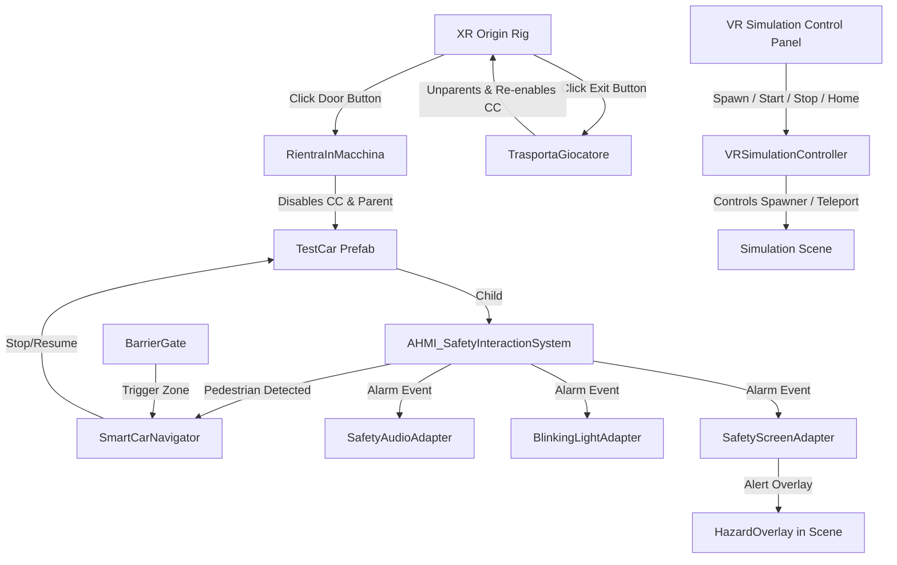

# Valet Guidance & Safety Simulation Guide

This document provides a comprehensive guide to understanding, setting up, and playtesting the fully integrated Valet Guidance and Safety Simulation in the VR prototype.

---

## 1. System Architecture Overview

The scene is divided into several modular subsystems that communicate dynamically at runtime. This design allows vehicles and UI overlays to be spawned on command without breaking scene-level references.

### Key Components & Files

*   **VR UI Canvas Prefab**: [VRControlPanelCanvas.prefab](file:///d:/Polimi/4th%20Sem/AHMI/Project/Unity/Prototype/Assets/PreFabs/VRControlPanelCanvas.prefab)
    A world-space VR menu designed with futuristic slate-blue backgrounds, cyan accents, and sliced capsule buttons. Spawns directly in front of the player's view.
*   **Runtime UI Controller**: [VRSimulationController.cs](file:///d:/Polimi/4th%20Sem/AHMI/Project/Unity/Prototype/Assets/Scripts/CarTraffic/VRSimulationController.cs)
    Handles toggling the UI canvas, binding VR button click events, pausing/resuming spawning, clearing active cars/NPCs from the scene, and teleporting the player home.
*   **Player Progression Controller**: [PlayerCarProgression.cs](file:///d:/Polimi/4th%20Sem/AHMI/Project/Unity/Prototype/Assets/Scripts/CarTraffic/PlayerCarProgression.cs)
    Manages spawning the player's custom `TestCar` at the entrance spawn point and tracks the player's boarding status (`IsPlayerInsideCar`).
*   **Physical Door Interaction Buttons**: [TeleportButton.cs](file:///d:/Polimi/4th%20Sem/AHMI/Project/Unity/Prototype/Assets/AHMI_MyPlayer/TeleportButton.cs)
    Attached to the physical `ReturnButton` (driver door), `ReturnButton_Passenger` (passenger door), and internal `ChangeButton` (cockpit exit button). Disables the player's `CharacterController` during teleportation to prevent physics jitter and camera displacement, and updates the state machine's boarding status.
*   **Central Valet Brain**: [ValetGuidanceSystem.cs](file:///d:/Polimi/4th%20Sem/AHMI/Project/Unity/Prototype/Assets/Scripts/CarTraffic/ValetGuidanceSystem.cs)
    Manages active car registration, random vacant parking spot allocation, ETA calculations, and vehicle state transitions.

---

## 2. Controls & Interaction Schemes

The simulation features a **100% VR-native interaction scheme** that does not require any keyboard inputs or legacy developer overlays during headset gameplay.

### VR Controls (Quest Controller)

*   **Toggle Control Panel**: Press the **`X`** button on your **Left Quest Controller** to open or close the Simulation Control Panel. (In the Unity Editor, press the **`U`** key as a keyboard shortcut).
*   **Raycast Pointer Selection**: Use either Quest controller's pointer ray to target buttons on the Control Panel and click the **Index Trigger** to select.
*   **Enter Vehicle (Outside)**: Aim your controller ray at the glowing physical button on the driver's door (**`ReturnButton`**) or the passenger's door (**`ReturnButton_Passenger`**) and click to enter.
*   **Exit Vehicle (Inside)**: Look inside the car cockpit, target the physical **`ChangeButton`**, and click to exit.

### Keyboard Fallbacks (Editor Debugging)

For rapid testing in the Unity Editor without a VR headset, the following keyboard hotkeys are available:

| Key | Action | Description |
| :--- | :--- | :--- |
| **`P`** | **Spawn Test Car** | Spawns [TestCar](file:///d:/Polimi/4th%20Sem/AHMI/Project/Unity/Prototype/Assets/PreFabs/TestCar.prefab) at the entrance and pauses NPC traffic. |
| **`G`** | **Toggle Boarding** | Teleports player inside (driver seat) or outside (sidewalk) the car. |
| **`Enter`** | **Progress Valet State** | Drives the car forward to the next stop (e.g. Drop-off -> Parking -> Pick-up -> Exit). |
| **`U`** | **Toggle UI Panel** | Toggles the VR Simulation Control Panel Canvas on-screen. |

> [!NOTE]
> All legacy debug `OnGUI` sliders and overlays have been completely removed from the screen to provide a clean, immersive simulator.

---

## 3. Step-by-Step Playtest Walkthrough

Follow this walkthrough to verify the entire system flow in VR:

### Phase 1: Spawning & Entering the Car
1. Put on your VR headset and start the simulation scene.
2. The welcome screen is displayed. Click **ENTER SIMULATION** to dismiss it.
3. Press **`X`** on your left controller to open the Control Panel, then click **SPAWN CAR**.
4. The custom `TestCar` appears at the entrance gate.
5. Close the Control Panel, walk up to either the driver or passenger door, aim your pointer ray at the glowing physical door button, and click to teleport inside.
6. The entrance gate bar rotates open automatically, the car headlights glow turquoise (autonomous mode active), and the car drives to the **Drop-Off Point**.

### Phase 2: Leaving the Car & Auto-Parking
1. The car stops at the Drop-Off area sidewalk. The internal dashboard screen displays the valet greeting overlay.
2. Look at the cockpit dashboard, aim your pointer ray at the physical **`ChangeButton`**, and click it. You are teleported onto the sidewalk next to the car.
3. The car automatically computes a path to a **randomly selected vacant parking spot** in the garage and reverse parks itself.
4. Once the car is parked, the NPC Spawner resumes spawning traffic to populate the environment.

### Phase 3: Pedestrian Crosswalk & Safety Verification
1. Walk to the crosswalk. NPCs will exit the elevator lobby and walk towards the street.
2. Watch the **Pedestrian Traffic Lights**:
   * If a car is approaching, the light bar remains red for pedestrians.
   * Once the car is detected inside the stop boundaries, the pedestrian light turns green, allowing NPCs to cross.
   * If a pedestrian crosses the road while a vehicle approaches, the safety system triggers: **the vehicle's headlights blink, an alert buzzer sounds, and the internal HUD shows a red alert** while the vehicle brakes smoothly. The car automatically resumes once the pedestrian is clear of the crossing area.

### Phase 4: Recalling the Car
1. Walk to the **Recall Totem** located in the elevator lobby.
2. Stand in the totem trigger zone and press **`E`** (or select the recall trigger).
3. The ETA Billboard updates to show your car's plate number (`PLAYER-1`) and countdown.
4. The car starts up, reverses out of its parking spot, and drives to the **Pick-Up Point**.

### Phase 5: Exit & Cleanup
1. Once the car arrives at the Pick-Up Point sidewalk, click the door button to get back inside.
2. The car drives to the Exit Gate, which opens automatically.
3. Once through the gate, you are safely unparented from the car, placed on the exit sidewalk, and the vehicle is cleaned up and de-registered from the valet database.

---

## 4. Editor Automation Tools

Several editor menu utilities are available in the top menu bar under **`Tools`** to configure or regenerate simulation assets:

*   **`Tools/Create VR Canvas Prefab`**
    Programmatically draws custom dashboard textures (`DashboardBG.png`, `ButtonBG.png`), configures 9-sliced sprite borders on the capsule buttons, and saves a fresh [VRControlPanelCanvas.prefab](file:///d:/Polimi/4th%20Sem/AHMI/Project/Unity/Prototype/Assets/PreFabs/VRControlPanelCanvas.prefab) with premium typography.
*   **`Tools/Setup VR Scene UI`**
    Clears the old simulation manager in the active scene, spawns a new `SimulationControlManager`, attaches [VRSimulationController](file:///d:/Polimi/4th%20Sem/AHMI/Project/Unity/Prototype/Assets/Scripts/CarTraffic/VRSimulationController.cs), links the prefab asset, and auto-resolves all system references.
*   **`Tools/Setup TestCar Interactables`**
    Loads the player's car prefab, duplicates the driver door button, and places it at the mathematically perfect mirrored coordinate on the passenger door, ensuring both sides have colliders and interactable triggers.
