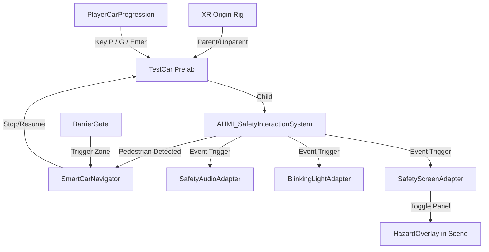

# Valet Guidance & Safety Simulation Guide

This document provides a comprehensive guide to understanding and playtesting the fully integrated Valet Guidance and Safety Simulation in **SampleScene**. Share this guide with your team to help them test the features, verify safety triggers, and navigate the valet flow.

---

## 1. System Architecture Overview

The scene is divided into several modular subsystems that communicate dynamically at runtime. This design allows vehicles to be spawned on command without breaking references to static scene objects.

### Key Components & Files

*   **Player Progression Controller**: [PlayerCarProgression.cs](file:///d:/Polimi/4th%20Sem/AHMI/Project/Unity/Prototype/Assets/Scripts/CarTraffic/PlayerCarProgression.cs)
    Manages spawning the player's custom car, boarding/unparenting the VR camera rig, and manually progressing valet states.
*   **Central Valet Brain**: [ValetGuidanceSystem.cs](file:///d:/Polimi/4th%20Sem/AHMI/Project/Unity/Prototype/Assets/Scripts/CarTraffic/ValetGuidanceSystem.cs)
    Manages active car registration, random parking spot allocation, ETA updates, and simulation state progression.
*   **Safety Interaction System**: [AHMI_SafetyInteractionSystem.prefab](file:///d:/Polimi/4th%20Sem/AHMI/Project/Unity/Prototype/Assets/AHMI_SafetyInteractionSystem/Prefabs/AHMI_SafetyInteractionSystem.prefab)
    Nested directly inside [TestCar.prefab](file:///d:/Polimi/4th%20Sem/AHMI/Project/Unity/Prototype/Assets/PreFabs/TestCar.prefab) at local `(0, 0, 0)`. Auto-wired on spawn to trigger collision alarms, hazard light blinks, and screen alerts.
*   **Dynamic ETA Manager**: `AHMI_ETA_Manager` (Scene Object)
    Houses the ETA Billboard, parking endpoints, and the interactive Totems.
*   **Internal Vehicle Screens**: `AHMI_InternalScreenSystem` (Scene Object)
    Contains the welcome and state transition screen overlay, alongside triggers at gates.

---

## 2. Keyboard & Testing Controls

When testing in Unity Play Mode, use the following hotkeys to control the player vehicle and spawner settings:

| Key | Action | Description |
| :--- | :--- | :--- |
| **`P`** | **Spawn Player Car** | Instantiates [TestCar](file:///d:/Polimi/4th%20Sem/AHMI/Project/Unity/Prototype/Assets/PreFabs/TestCar.prefab) at the entrance gate and pauses the NPC spawner. |
| **`G`** | **Board / Exit Vehicle** | **Board**: Parents the VR Rig inside the car driver's seat.  **Exit**: Unparents the rig, snaps it next to the door, and restores normal movement. |
| **`Enter`** | **Progress Valet State** | Drives the car forward to the next stop (e.g. Drop-off to Parking, Parking to Pick-up, Pick-up to Exit). |
| **`E`** (at Totem) | **Request/Recall Car** | Triggers the ETA calculation and recalls the spawned vehicle to the Pick-up area. |

### In-Game Control Panel (GUI)
A semi-transparent settings panel will appear on-screen during Play Mode. It allows you to:
*   Adjust **Max NPC Cars** dynamically using a slider (Range: 1 to 20).
*   Change the **NPC Spawn Interval** (Range: 1 to 60 seconds).
*   Use the **"Force Spawn Car Now"** button to manually spawn a new NPC vehicle.

---

## 3. Step-by-Step Playtest Walkthrough

Follow these steps to verify the entire system end-to-end:

### Phase 1: Spawning & Gate Entry
1. Enter Play Mode and press **`P`** to spawn the player car at the entrance.
2. The Entrance Gate bar will rotate open automatically.
3. Press **`G`** to seat the VR Player inside the car.
4. Press **`Enter`** (Return) to begin. The car headlights will change to turquoise (Autonomous mode), and the car will drive automatically to the **Drop-Off Point**.

### Phase 2: Drop-Off & Auto-Parking
1. Once the car reaches the Drop-Off area, it stops and the internal screen transitions to show a Welcome/Transition screen.
2. Press **`G`** to exit the vehicle. The VR camera rig unparents and places you on the sidewalk.
3. Press **`Enter`** to progress. The car will automatically find a **random vacant parking spot** and reverse park itself.
4. Once parked, the NPC Spawner automatically resumes spawning traffic to populate the garage.

### Phase 3: Pedestrian Crosswalk & Safety Verification
1. Walk to the crosswalk. Pedestrians (NPCs) will walk out of the elevator lobby.
2. Observe the **Pedestrian Traffic Lights**:
   * If a car is approaching, the light bar remains red for pedestrians.
   * When safe, the light bar turns green, and pedestrians cross.
   * If a pedestrian is in the road when a car approaches, the car's **headlights blink, a warning buzzer sounds, and the internal HUD shows a "Hazard" alert** while the car brakes smoothly. It resumes once the pedestrian clears the zone.

### Phase 4: Recall at the Totem
1. Walk to the new **Totems** next to the elevator (under `AHMI_ETA_Manager/UI/Totem`).
2. Stand inside the trigger zone of a Totem and press **`E`** (or press **`Enter`** on the keyboard).
3. The ETA Billboard will update to display the car's Plate Number, Status, and countdown.
4. The car will exit its parking spot, reverse out, and navigate to the **Pick-Up Point**.

### Phase 5: Exit & De-Registration
1. When the car stops at the Pick-Up Point, walk to it and press **`G`** to board.
2. Press **`Enter`** to progress to the Exit.
3. The car will navigate to the Exit Gate, which automatically opens.
4. Once through the gate, the VR Player is safely unparented and returned to the entrance sidewalk, and the vehicle is cleaned up/de-registered from the active valet session.

---

## 4. Troubleshooting & Verification Tips

*   **Safety Zone Boundaries**: The safety sphere collider is located directly in front of the vehicle. Ensure that pedestrians are tagged with the `DynamicUser` layer, which is the only layer the car's detection zone responds to.
*   **Dynamic Triggers**: Gate triggers (which trigger screen states) do not require static object assignments. They will dynamically filter and activate for any vehicle carrying the [SmartCarNavigator](file:///d:/Polimi/4th%20Sem/AHMI/Project/Unity/Prototype/Assets/Scripts/CarTraffic/SmartCarNavigator.cs) component.
*   **Console Validation**: If the console is clear of red errors, all systems are communicating. All scripts contain protective null-checks to prevent exceptions during scene transitions or when no VR headset is connected.
